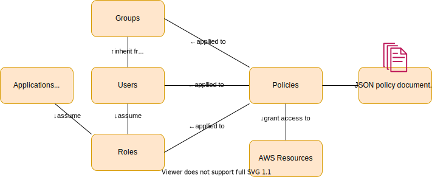

# Everything you need to know about AWS IAM

Identity and Access Management. A global service (meaning settings are not region-specific).

Allows to manage users', groups', roles' access to AWS resources through the Management Console and programmatically (through CLI or SDK).



Features include:
* MFA (multi-factor authentication)
* password policies incl. password rotation
* granular permissions
* permission boundaries - advanced feature to limit the maximum permissions of a user

Authentication = validation of who you are. If your username + password are correct, you are authenticated (signed in).
Authorization = what can you do.

IAM identity = root user / user or service / federated user (SSO) / group / role

Note: term IAM identity and IAM entity are used loosely and inconsistently in the industry so don't sweat over its precise meaning.


## User
User has:
* a friendly name
* an ARN (`arn:aws:iam::account-ID-without-hyphens:user/Mateusz`)
* a unique ID
* a console password
* an access key id and secret

Each user is associated with one AWS account. Users' activity is billed to that account.

When user represents a service making AWS requests, the user is referred to as a service account.

Note: do not embed access keys directly into the application code, either put them in `~/.aws` on the host or use roles instead.


## Policy
A document in JSON format that defines permissions.

When you define access policies, you  specify which IAM _principals_ are allowed to perform what _actions_ on specific AWS _resources_ and under which _conditions_.

Policies (one or many) are attached to users / groups / roles.

Policy types:
* vendor (AWS) managed
* customer managed
* inline - attached to a single user. Cannot be shared.

Policies can be identity-based or resource-based.

Trust policy - a policy in which you define the principal that you trust to assume a role. Every role must have trust policy attached.

```json
{
  "Version": "2012-10-17",
  "Statement": [
    {
      "Sid": "S3ReadAccess",  // statement id; optional, must be unique within a JSON policy
      "Effect": "Allow",
      "Principal": { "AWS": "arn:aws:iam::1234567890:username"},
      "Action": ["s3:List*", "s3:Get*"],
      "Resource": [
        "arn:aws:s3:::my-bucket/*"
      ],
      "Condition": [...]
    }
  ]
}
```
[Syntax reference](https://docs.aws.amazon.com/IAM/latest/UserGuide/reference_policies.html)


## Role
A user / service can be granted permission to _assume a role_ on a temporary basis, allowing it to perform a given task. It is then provided with temporary security credentials for the duration of a session.

Role has a "who policy" (trust policy) and "what policy" (permissions policy).

Roles can be used by:
* IAM user
* IAM user in a different AWS account
* service like EC2
* external user authenticated by an external IdP (either web IdP like Facebook or an enterprise user with SAML2.0 or OpenID)

Roles can be chained.


## EC2 Instance Profile
EC2 Instance Profile is a container for a _single_ IAM role that you can use to pass role information into an EC2 instance when the instance starts.

The benefit is that you don't need to figure out how to securely pass and rotate credentials yourself.

If you use the AWS Management Console to create a role for EC2, the console automatically creates an instance profile and gives it the same name as the role. This is not the case for API and CLI where instance profile needs to be separately created.


## Root
Every AWS account has a root user with full access to everything. Use of the root account should be minimized for security and root user should immediately create IAM users and groups. You cannot switch roles when you sign in as the AWS account root user.

Checklist:
* Enable MFA in AWS Console -> "My Security Credentials" or in the IAM dashboard
* Enable IAM users to see billing information. Open the AWS Console as root user -> "My Account" -> "IAM User and Role Access to Billing Information" -> enable "Activate IAM Access".
* (optional) Force IAM users to use MFA.
* Apply password policies (length, allowed characters, rotation policy)
* Setup notifications for excessive spending
  - either setup a Budget with alerts
  - or setup CloudWatch alarms

## Resources
* [AWS IAM User Guide](https://docs.aws.amazon.com/IAM/latest/UserGuide)
* [Cloud Guru: AWS IAM - Deep Dive](https://acloudguru.com/course/aws-iam-identity-and-access-management-deep-dive)


